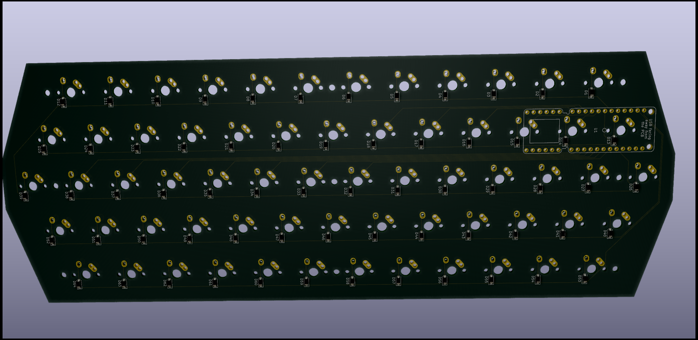
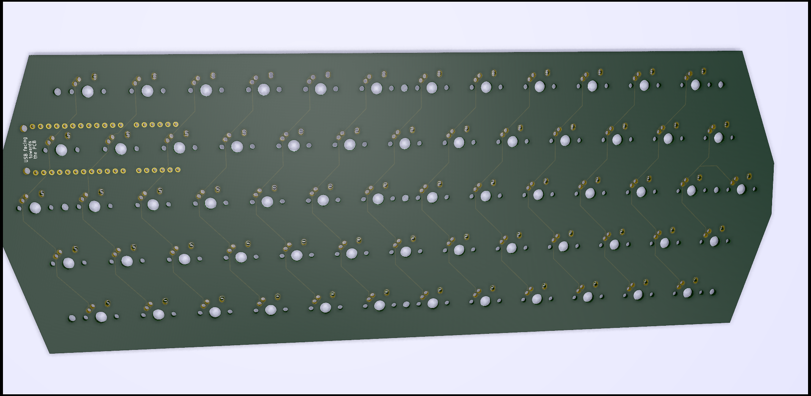

# Schematic for a hexalinear keyboard PCB

This is a KiCad project for a hexalinear keyboard PCB using a breakout Proton C as a controller.

Required libraries:

- [`kicad_lib_tmk`](https://github.com/tmk/kicad_lib_tmk)
- [`qmk_hardware`](https://github.com/qmk/qmk_hardware)

